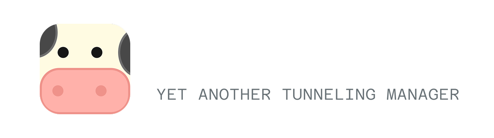

A self-hosted tunneling solution I built to manage multiple port forwards easily. It comes with a web dashboard, supports TCP/UDP, and handles SSL automatically for you.

Basically, it's a tool to expose your local services to the internet using your own VPS.

 

## Features

- **Web Dashboard**: Visual interface to manage tunnels.
- **SSL/HTTPS**: Automatically gets Let's Encrypt certificates for your custom domains.
- **Persistent**: Tunnels stay up and restore after restarts.
- **Port Ranges**: You can forward a whole range (e.g., 3000-3010) in one go.
- **Monitoring**: Shows live traffic stats.

## How to Run

You need a generic Linux/Windows VPS for the server and your local machine for the client.

### 1. Server Setup (VPS)
Run the server binary on your VPS. It listens on port `64290` by default.

```bash
# Start server (setup mode)
./tunnelcow-server(.exe)

# Or with flags (legacy/override)
./tunnelcow-server(.exe) --token your-secret-token
```

On first run, it will **generate a secure token** and save it to `data/server_config.json`.

### 2. Client Setup (Local)
Run the client without any arguments to start the interactive setup.

```bash
./tunnelcow-client(.exe)
```

This will launch a **Setup Wizard** where you will configure:
- Server Address (e.g., `1.2.3.4:64290`)
- Authentication Token
- Dashboard Password
- Debug Mode

Configuration is saved to `data/client_config.json`. Next time, just run `./tunnelcow-client(.exe)` to connect automatically!

To override temporarily:
```bash
./tunnelcow-client(.exe) --token my-temp-override-token
```

### 3. Dashboard
Once running, open the dashboard in your browser:
http://localhost:10000

Login with the password you set.

## SSL Domains

If you want HTTPS for your local app:
1. Point your domain (e.g., `app.example.com`) to your VPS IP address.
2. In the dashboard, go to **Domains**.
3. Add the domain and select which tunnel it maps to.
4. The server will handle the Let's Encrypt challenge and serve HTTPS.

## Building from Source

If you want to modify the code or build it yourself:

**Prerequisites:** Go 1.25+, Node.js 18+

```powershell
# 1. Clone repository
git clone https://github.com/mmhdysff/tunnelcow
cd tunnelcow

# 2. Install Frontend Dependencies
cd web
npm install
cd ..

# 3. Build Project
.\build.ps1 or build.sh
```

This will generate `tunnelcow-client` and `tunnelcow-server` binaries in the root folder.

## Project Structure

- `cmd/tunnelcow-client`: Client code & API
- `cmd/tunnelcow-server`: Server & control logic
- `internal/`: Shared logic (tunnel protocol, auth, ui)
- `web/`: React frontend (dashboard)

## License

MIT. Use it however you want.
